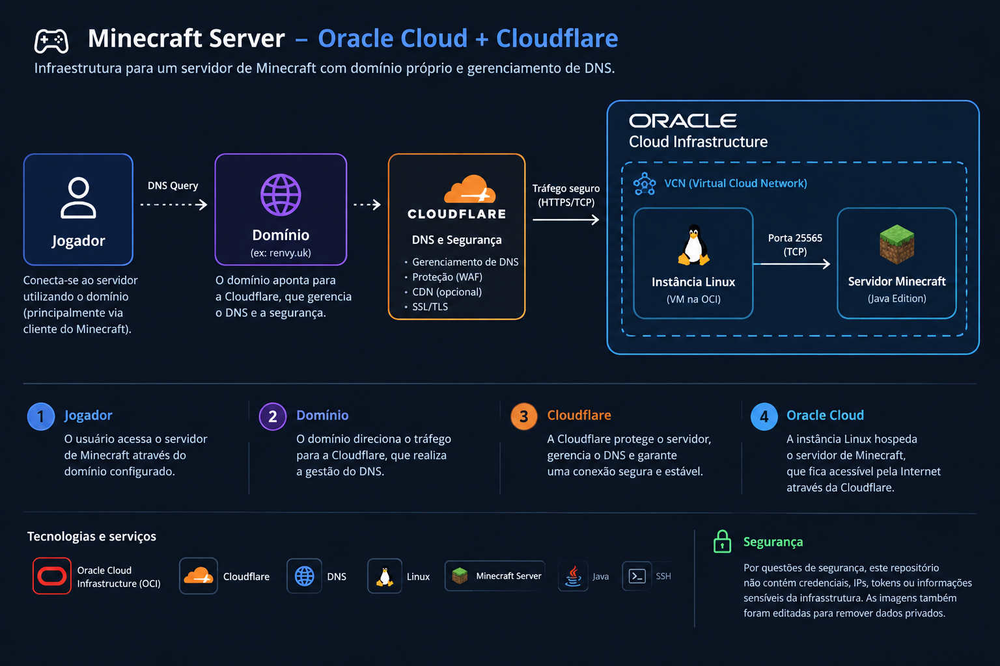
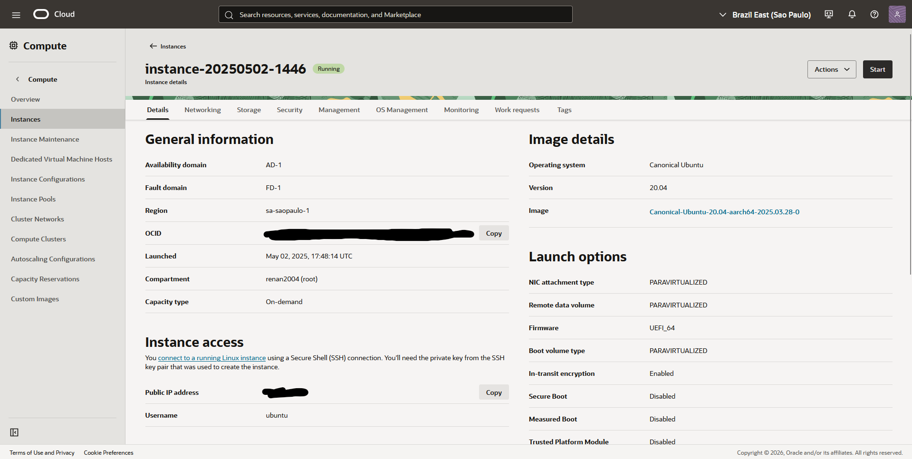
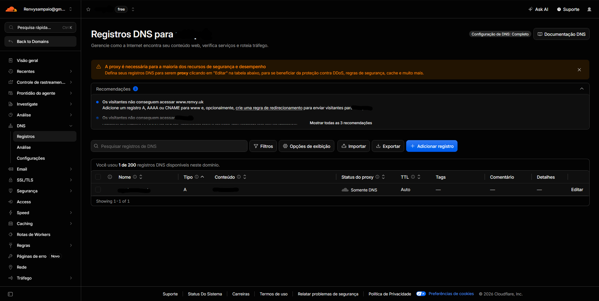

# 🎮 Minecraft Server - Oracle Cloud + Cloudflare

Projeto pessoal de infraestrutura desenvolvido para hospedar um servidor de Minecraft utilizando **Oracle Cloud**, **Ubuntu Linux** e **Cloudflare DNS**, com domínio próprio.

## 🛠️ Tecnologias e serviços

| Tecnologia / Serviço | Utilização |
|---|---|
| **Oracle Cloud Infrastructure (OCI)** | Hospedagem da máquina virtual |
| **Ubuntu Linux** | Sistema operacional da instância |
| **Cloudflare** | Gerenciamento de DNS |
| **DNS** | Resolução do domínio |
| **Java** | Ambiente de execução do servidor Minecraft |
| **SSH** | Acesso remoto à instância |
| **Minecraft Server** | Serviço hospedado |

## 🏗️ Arquitetura

A Cloudflare é utilizada para gerenciamento e resolução do DNS, enquanto o servidor de Minecraft é executado diretamente em uma instância Linux da Oracle Cloud.

## 🔧 O que foi realizado

- Criação e configuração de uma instância na Oracle Cloud;
- Configuração do Ubuntu e acesso remoto via SSH;
- Instalação e configuração do servidor de Minecraft;
- Configuração de rede e portas;
- Registro e configuração do domínio;
- Configuração do DNS através da Cloudflare;
- Testes de conectividade e acesso externo.

## ☁️ Infraestrutura

A infraestrutura utiliza uma instância Linux hospedada na Oracle Cloud para executar o servidor de Minecraft.

## 🌐 DNS

O domínio foi configurado utilizando a Cloudflare para gerenciamento dos registros DNS e direcionamento para a infraestrutura hospedada na Oracle Cloud.

## 🔒 Segurança

Informações como domínio, IP, credenciais e outros dados sensíveis foram ocultadas das imagens e não estão presentes no repositório.

## 📌 Status

**Projeto pessoal concluído.**

Experiência prática com **cloud computing, servidores Linux, redes, DNS e troubleshooting**.
